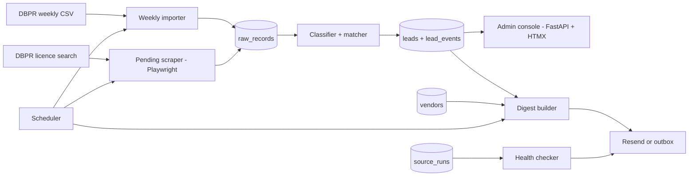

# OpeningSoon FL — PRD

Oct 3, 2026 · Donald Miller · Living version: https://claude.ai/code/artifact/0df18eca-8740-4ca8-a9b1-fc3b81fc1c29

## Overview

OpeningSoon FL tells vendors about new Florida restaurants weeks before they open, starting with Brevard County. It merges public DBPR licence data, including applications still in progress, into one lead per restaurant and emails each subscribed vendor the new leads every week.

| Reference product | What we recreate | What we skip |
| --- | --- | --- |
| ConstructConnect / Dodge | Leads tagged by stage (applied, licensed) with a dated timeline; alerts on new leads | Bidding, plan rooms, national coverage |
| BuildZoom | Normalising messy public records into one clean record per project | Contractor ratings, consumer marketplace |
| Apollo | Lead card layout, contact panel, CSV export | Email sequencing, dialer, credit system |
| beehiiv | Nothing in v1. Use the product itself for the later newsletter | Building any newsletter tooling |

### The problem

A new restaurant buys POS, equipment, insurance, payroll, pest control and food supply all at once, before opening day. The vendor who reaches the owner first usually wins. The early signals are public but spread across several Florida government sites that nobody checks every day, and generic "new business" lists aren't restaurant-specific or early enough.

## Goals and non-goals

v1 must produce a reliable weekly Brevard lead feed that the operator can sell to the first 2–3 paying vendors.

1. Import the DBPR weekly licence data for Brevard automatically and turn it into clean restaurant leads, with no duplicates across re-runs.
2. Scrape DBPR "Application in Progress" records daily, so most leads appear before the licence is issued.
3. Merge every signal about the same restaurant into one lead, with a dated stage timeline and a "days ahead" figure.
4. Email each active vendor the leads it hasn't seen yet, weekly or daily, with a CSV attached.
5. Give the operator one admin console to review leads, manage vendors, preview digests and see source health.
6. Alert the operator within 24 hours when a source breaks or silently returns nothing.

**Non-goals for v1**

- Vendor self-serve accounts, logins or a vendor portal
- Billing, Stripe or invoicing (invoice the first customers manually)
- Sunbiz, building permits and liquor licences (P2, staged later)
- Paid contact enrichment (phone and email lookup APIs)
- Counties other than Brevard (the data model supports them; ingestion is configured for Brevard only)
- The public "new openings" newsletter and sponsorships
- CRM features: notes per vendor, deal tracking, outreach sequences
- Multiple admin users, roles or audit trails
- Mobile apps, a public API or webhooks

## Users and user stories

The only logged-in user is the operator, who runs the pipeline, manages vendors and sells the leads. Vendors (POS resellers, equipment dealers, insurance agents and so on) never log in in v1. They only receive email digests.

| # | As a user, I want to… | So that… |
| --- | --- | --- |
| U1 | As the operator, export this week's new Brevard restaurants as a CSV | I can pitch vendors with a real sheet before anything else is built |
| U2 | As the operator, see restaurants that are still "Application in Progress" | I can sell the "weeks ahead" promise, not a list everyone already has |
| U3 | As the operator, open a lead and see every source record and date behind it | I can trust the data before a vendor acts on it |
| U4 | As the operator, add a vendor with a category, region and cadence | it starts receiving digests without code changes |
| U5 | As the operator, preview and test-send a vendor's digest | I can show a prospect exactly what they'd get |
| U6 | As the operator, get an email when a source breaks or returns nothing | I fix scrapers before a paying vendor notices a thin digest |
| U7 | As a vendor, get one email a week listing only restaurants I haven't seen, with a CSV | I can start outreach straight away without de-duplicating |
| U8 | As a premium vendor, get the digest daily | I reach owners before my weekly-tier competitors |

## Functional requirements

v1 ingests two DBPR sources for Brevard, turns them into one lead per restaurant, and delivers those leads by email. Requirement IDs are referenced by tests and milestones.

### Data sources

| Source | Signal | Cadence | Stage | v1? |
| --- | --- | --- | --- | --- |
| DBPR Hotels & Restaurants weekly licence download (CSV) | Licence issued | Weekly | Licensed | Yes |
| DBPR online licence search ([myfloridalicense.com](https://www.myfloridalicense.com/)) | "Application in Progress" | Daily scrape | Applied | Yes |
| Sunbiz LLC filings (bulk data download) | New entity with a restaurant-like name or officer | Daily | Formed | P2 |
| County building permits (Brevard portal) | Tenant build-out or change of use to restaurant | Daily | Permitted | P2 |
| DBPR Alcoholic Beverages & Tobacco applications | Liquor licence applied | Weekly | Applied | P2 |

### Lead definition

- A **lead** is one restaurant at one street address, identified by `lead_key` = normalised business name + normalised street address + ZIP.
- **Counts as a lead:** a new food-service licence or application in a restaurant class. That's Permanent Food Service, seating or non-seating.
- **Tagged, not dropped:** change of ownership (`lead_type = ownership_change`) and mobile food vehicles (`lead_type = mobile`).
- **Never a lead:** renewals, status changes on existing licences, and closures.

### Ingestion (I)

| ID | Requirement | Priority |
| --- | --- | --- |
| I1 | Import the DBPR weekly licence file and keep only Brevard rows | P0 |
| I2 | Imports are idempotent: re-running on the same file creates zero new raw records or leads | P0 |
| I3 | Store every fetched record unchanged in `raw_records` with source, fetched_at and a content hash | P0 |
| I4 | Scrape DBPR licence search daily for Brevard food-service records with status "Application in Progress" | P0 |
| I5 | Scrapers wait at least 2 s between requests, send an identifying User-Agent, and retry 3 times with backoff | P0 |
| I6 | `SOURCE_MODE=fixture` replays committed fixture files instead of hitting the network | P0 |
| I7 | Manual CSV upload in admin as a fallback when a source is down | P1 |
| I8 | Sunbiz, permits and liquor-licence adapters | P2 |

### Leads (L)

| ID | Requirement | Priority |
| --- | --- | --- |
| L1 | Classify each raw record as new, ownership change, mobile, or ignored (renewal or other) | P0 |
| L2 | Records from both sources with the same `lead_key` merge into one lead, with one `lead_event` per source record | P0 |
| L3 | A lead's stage is the most advanced stage among its events (Applied < Licensed), and `first_seen_at` is its earliest event and never moves later | P0 |
| L4 | `days_ahead` = licence-issued date minus `first_seen_at`, in days, shown once the lead is licensed | P0 |
| L5 | The operator can hide a lead, edit its display name, and add a note | P1 |
| L6 | The operator can manually merge two leads, or split one | P1 |

### Vendors (V)

| ID | Requirement | Priority |
| --- | --- | --- |
| V1 | Create, edit and deactivate a vendor with fields: name, contact email(s), category, counties, cadence (weekly or daily) and active | P0 |
| V2 | Categories are seeded: POS, Equipment, Insurance, Payroll, Pest control, Food supply, Other | P0 |
| V3 | Warn (don't block) when a category already has `MAX_VENDORS_PER_CATEGORY` active vendors in a county | P1 |

### Digests (E)

| ID | Requirement | Priority |
| --- | --- | --- |
| E1 | Weekly digest every Monday at 07:00 America/New_York to each active weekly vendor. It lists every lead in its counties not yet delivered to that vendor | P0 |
| E2 | Daily digest at 07:00 America/New_York for vendors with cadence daily | P1 |
| E3 | A lead is delivered to a vendor at most once, enforced by a unique (vendor, lead) row in `deliveries` | P0 |
| E4 | Each digest attaches `leads-YYYY-MM-DD.csv`. Admin can export any filtered lead list as CSV, and a CLI exports the Brevard sheet | P0 |
| E5 | Admin can preview a vendor's next digest and send a test copy to the operator's email | P0 |
| E6 | A digest with zero new leads is still sent, saying "No new restaurants this week" | P1 |
| E7 | Every digest has a working unsubscribe link and the operator's postal address | P0 |
| E8 | `EMAIL_MODE=outbox` writes emails to an `outbox` table instead of sending. `EMAIL_MODE=resend` sends through Resend | P0 |

### Admin console (A)

| ID | Requirement | Priority |
| --- | --- | --- |
| A1 | Single operator login, with a password from `ADMIN_PASSWORD` and a session cookie | P0 |
| A2 | Leads table filterable by stage, lead type, county and first-seen date range, plus text search on name or address | P0 |
| A3 | Lead detail page with a stage timeline and the raw source records behind each event | P0 |
| A4 | Dashboard with new leads this week, leads still Applied, active vendors, and the last run per source | P0 |

### Source health (H)

| ID | Requirement | Priority |
| --- | --- | --- |
| H1 | Every job run records source, status, rows fetched, rows new, duration and error text in `source_runs` | P0 |
| H2 | Email the operator when a run fails, returns 0 rows while its 4-week average is above 0, or sees changed CSV columns | P0 |
| H3 | Health page with one row per source, green, amber or red, and the last 10 runs | P0 |

## Non-functional requirements

v1 runs as one Docker Compose stack on a small VPS for under $20 a month, and every external dependency can be swapped for a deterministic fake in tests.

| Area | Requirement |
| --- | --- |
| Performance | Weekly import of one county finishes in under 5 min. Daily scrape of Brevard finishes in under 30 min. Admin pages load in under 500 ms with 10,000 leads |
| Politeness | At most 1 request every 2 s per government site. No parallel sessions. Results cached per run |
| Reliability | Jobs are idempotent and safe to re-run. A failed job never leaves partial leads, because each source run commits in one transaction |
| Scheduling | An in-app scheduler (APScheduler) runs jobs in the America/New_York timezone. Timestamps are stored in UTC |
| Security | Admin behind password + HTTP-only session cookie. Secrets only in `.env`. Test routes exist only when `TEST_ROUTES=1` |
| Deployment | `docker compose up -d` brings up app + Postgres. The v1 build is verified on local Compose. `docs/DEPLOY.md` covers a VPS with HTTPS via Caddy, which the operator runs |
| Configuration | All settings from env, validated at startup. The app refuses to start with a missing required key and names the key |
| Testability | `SOURCE_MODE=fixture`, `EMAIL_MODE=outbox` and `FAKE_NOW` (frozen clock) make every E2E test deterministic. Fixtures are real DBPR samples captured once in stage 0, trimmed and frozen, plus hand-made edge-case rows. A small `@smoke` suite hits live DBPR |
| Accessibility | Keyboard-usable admin, labelled form fields, WCAG AA contrast |
| UI style | ElevenLabs-like: white background, neutral greys, black primary buttons, pill-shaped inputs |
| Compliance | Digests are CAN-SPAM compliant (unsubscribe + postal address). Vendor terms put calling and texting compliance (TCPA) on the vendor |
| Cost | VPS about $6–12/mo. Resend free tier at v1 volume. No paid data APIs |

### Licensing

| Project | Licence | Implication |
| --- | --- | --- |
| DBPR licence data | Florida public records (Ch. 119, F.S.) | Free to collect and resell. Scrape politely |
| LaunchLedger (your repo) | Your own code | Copy its scaffolding freely |
| FastAPI, SQLAlchemy, Alembic | MIT | Use as code |
| Playwright | Apache-2.0 | Use as code |
| HTMX | 0BSD | Use as code |
| PostgreSQL | PostgreSQL Licence | Use freely |
| ConstructConnect, BuildZoom, Apollo | Proprietary | Copy functionality only, no code or branding |

## Technical architecture

One Python FastAPI service runs the scheduled source jobs, the lead matcher, the digest sender and the server-rendered admin console, all over one Postgres database.

### Stack

| Layer | Choice | Why |
| --- | --- | --- |
| Language / deps | Python 3.12, uv | Same as LaunchLedger |
| Web + API | FastAPI | Same as LaunchLedger. One process for API, admin and jobs |
| Admin UI | Jinja2 templates + HTMX | No SPA build step. Fast to test with Playwright |
| Database | PostgreSQL 16, SQLAlchemy 2, Alembic | Same as LaunchLedger. Unique constraints enforce de-duplication |
| Scheduling | APScheduler, in-process | No extra worker service at v1 scale |
| HTTP fetch | httpx | Weekly CSV download |
| Scraping | Playwright (Python) | The licence search is a form-driven site |
| Email | Resend (`EMAIL_MODE=resend`) or outbox table (`EMAIL_MODE=outbox`) | Cheap, simple API. Outbox makes digests testable |
| Tests | pytest + pytest-playwright E2E + `playwright-headless` MCP walkthrough | Tests-first acceptance contract, all in Python like LaunchLedger |
| Deploy | Docker Compose + Caddy on one VPS | Long-running scrapers rule out serverless |

### Data model

| Table | Key columns | Notes |
| --- | --- | --- |
| `source_runs` | id, source, started_at, finished_at, status, rows_fetched, rows_new, error | One row per job run (H1) |
| `raw_records` | id, source, source_record_id, content_hash, payload (jsonb), fetched_at, run_id | Unique (source, content_hash) |
| `leads` | id, lead_key, business_name, address, city, zip, county, lead_type, stage, first_seen_at, licensed_at, days_ahead, hidden, note | Unique lead_key |
| `lead_events` | id, lead_id, raw_record_id, stage, event_date | One per source record that touched the lead |
| `categories` | id, name | Seeded (V2) |
| `vendors` | id, name, emails[], category_id, counties[], cadence, active, unsubscribe_token | |
| `deliveries` | id, vendor_id, lead_id, digest_id, delivered_at | Unique (vendor_id, lead_id) (E3) |
| `digests` | id, vendor_id, kind (scheduled or test), sent_at, lead_count, email_id | |
| `outbox` | id, to, subject, html, attachments (jsonb), created_at | Used only when `EMAIL_MODE=outbox` |

### Key interfaces

| Name | Input | Effect |
| --- | --- | --- |
| `uv run osfl import-weekly` | `--county brevard`, optional `--file path.csv` | Runs I1–I3 + matcher, writes a `source_runs` row |
| `uv run osfl scrape-pending` | `--county brevard` | Runs I4 + matcher |
| `uv run osfl export-csv` | `--county brevard --since YYYY-MM-DD --out leads.csv` | Writes the lead sheet (U1) |
| `uv run osfl send-digests` | `--cadence weekly or daily` | Builds and sends due digests (E1, E2) |
| `GET /health` | none | `200 {"status":"ok","db":"ok"}` |
| `GET /leads`, `GET /leads/{id}` | filters as query params | Admin pages (A2, A3) |
| `GET /leads.csv` | same filters | CSV export (E4) |
| `GET/POST /vendors`, `/vendors/{id}` | form fields | Vendor CRUD (V1) |
| `GET /vendors/{id}/digest/preview`, `POST /vendors/{id}/digest/test` | none | Preview and test send (E5) |
| `GET /sources` | none | Health page (H3) |
| `GET /unsubscribe/{token}` | none | Deactivates the vendor and shows a confirmation (E7) |
| `POST /test/clock`, `POST /test/run/{job}`, `GET /test/outbox`, `POST /test/reset` | JSON | Test-only, mounted only when `TEST_ROUTES=1` |

### Rules that are easy to get wrong

- **Lead identity:** normalise before hashing. Upper-case, strip punctuation, collapse spaces, drop LLC/INC/CORP suffixes, and use the USPS abbreviations (STREET→ST, SUITE→STE). Units stay part of the address.
- **`first_seen_at` only moves earlier.** A later licence record never resets it. That's what makes `days_ahead` truthful.
- **Renewals never create a lead,** even when the matcher hasn't seen that licence before.
- **The unique constraint on (vendor, lead) is the de-duplication guarantee.** Don't rely on a timestamp comparison.
- **No test touches the network.** Fixture mode is the default in tests, and live-site checks are tagged `@smoke`.
- **Times:** store UTC and schedule in America/New_York. Weekly windows are computed from `FAKE_NOW` when it's set.
- **Event dates:** an Applied event is dated the day (ET) the scrape first observed it. A Licensed event is dated with the licence issue date from the record. So a lead first seen in the weekly file has `days_ahead` = 0.
- **One scheduled digest per vendor per period.** A period is the ISO week for weekly vendors and the ET calendar day for daily ones. Re-running the job in the same period sends nothing.

## Milestones

Six stages take v1 from an empty repo to a deployed Brevard feed. Stage 1 alone replaces the manual "pull one week into a sheet" step of the business plan.

| Stage | Scope (requirement IDs) | Done when |
| --- | --- | --- |
| 0 Skeleton | Repo, uv, FastAPI, Postgres in Compose, Alembic, env validation, `/health`, pytest + Playwright harness, test routes, DBPR fixture capture spike, all E2E specs written | `docker compose up` → `GET /health` returns `{"status":"ok","db":"ok"}`. A missing `ADMIN_PASSWORD` stops startup with a message naming it. The E2E suite runs and fails only on unbuilt features |
| 1 Weekly import + lead sheet | I1, I2, I3, I6, L1, L3, E4 (CLI export) | `osfl import-weekly` on the fixture file creates exactly the fixture's expected Brevard new-restaurant leads. Renewals create none. A second run creates 0 records. `osfl export-csv` writes the sheet with the documented columns |
| 2 Pending scrape + merge | I4, I5, L2, L4 | A fixture pending application seen 2026-09-01 and its licence issued 2026-09-29 appear as one lead with two events, stage Licensed and `days_ahead` = 28 |
| 3 Admin console | A1–A4, V1, V2, L5, E4 (web export) | The operator logs in, filters leads to stage Applied, opens one and sees its timeline, creates vendor "Space Coast POS" (POS, Brevard, weekly) and downloads the filtered CSV |
| 4 Digests | E1, E3, E5, E6, E7, E8, E2, V3 | With the clock frozen at Monday 07:00 ET, the outbox holds one email per active weekly vendor listing only its undelivered leads, with the CSV attached. Running again sends nothing new. The unsubscribe link deactivates the vendor |
| 5 Source health + deploy | H1–H3, deploy docs, I7 | A fixture run returning 0 rows sends an alert to the outbox and shows the source red on `/sources`. The `@smoke` live import against DBPR succeeds. The full suite passes against the local Compose stack, and docs/DEPLOY.md gives the VPS + Caddy steps |
| Later (P2) | I8, L6, contact enrichment, vendor portal + Stripe, newsletter, more counties | Planned after 2–3 vendors pay |

## Success metrics, risks and open questions

v1 succeeds if 2–3 Brevard vendors pay within 30 days of the first pitch and the feed reliably shows restaurants at least two weeks before their licence is issued.

### Metrics

| Metric | Target |
| --- | --- |
| Paying vendors within 30 days of first pitch | 2 or more |
| Median `days_ahead` for leads first seen as Applied | 14 days or more |
| Share of licensed leads first seen as Applied | 50% or more |
| Scheduled job success rate | 95% or more per source per month |
| Time to detect a broken source | Under 24 h |
| Duplicate leads found in manual weekly review | 0 |

### Risks

| Risk | Likelihood | Mitigation |
| --- | --- | --- |
| Vendors won't pay (sales, not tech) | High | Stage 1 sheet ships first, so pitching starts in week 1. Price per region and category |
| Licence search doesn't expose "Application in Progress" by county, or adds a CAPTCHA | Medium | Stage 2 starts with a 1-hour spike. Fall back to weekly-only and move Sunbiz forward |
| Site changes break a scraper | Medium | Health alerts (H2), saved fixtures, manual CSV upload (I7) |
| Too few new Brevard restaurants a week to justify a subscription | Medium | Measure volume in stage 1. Add Orange and Volusia counties next |
| Matcher merges two restaurants or splits one | Medium | Strict normalisation rules, raw records on the lead page, manual merge/split (L6) |
| Digests land in spam | Medium | Verified sending domain with SPF/DKIM via Resend, plain HTML, no tracking pixels |
| Vendors misuse contact data (TCPA) | Low | Vendor terms. v1 ships no phone numbers from paid enrichment |

### Open questions

- [x] Base: a fresh repo reusing LaunchLedger's setup (FastAPI, uv, Alembic, Docker, Playwright E2E)
- [x] v1 sources: DBPR weekly file plus daily "Application in Progress" scrape, Brevard only
- [x] v1 surface: admin console + email digests + CSV. No vendor logins or billing
- [x] Test fixtures: real DBPR samples captured once in stage 0, plus hand-made edge cases
- [x] Tests: pytest-playwright specs plus a `playwright-headless` MCP walkthrough per stage
- [x] Deployment: the build ends on local Docker Compose plus docs/DEPLOY.md. The operator deploys to a VPS
- [ ] Assumed: DBPR licence search can be queried for Brevard food-service applications in progress without login or CAPTCHA
- [ ] Exact URL and columns of the DBPR weekly file for Brevard's district, to be confirmed in stage 1 and recorded in DECISIONS.md
- [ ] Assumed: ownership changes and mobile food vehicles are included, but tagged as their own lead types
- [ ] Assumed: weekly digests go out Monday 07:00 ET, and daily ones at 07:00 ET
- [ ] Assumed: the daily cadence is the only difference in the premium tier for v1
- [ ] Product name. "OpeningSoon FL" is a placeholder
- [ ] VPS host and sending domain for Resend

### References

- LaunchLedger (local repo to copy scaffolding from): `C:\Users\dkmil\vscode-workspace\LaunchLedger`
- [DBPR licence search](https://www.myfloridalicense.com/)
- [Sunbiz, Florida Division of Corporations](https://dos.fl.gov/sunbiz/)
